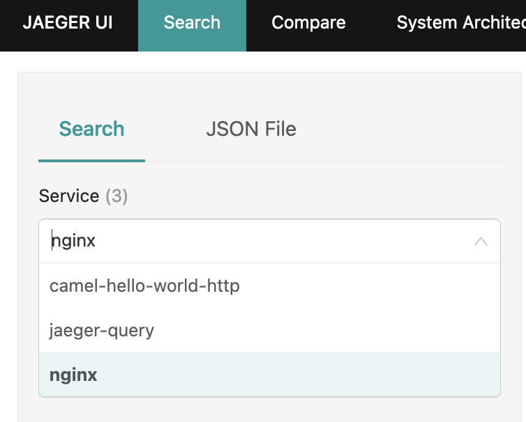
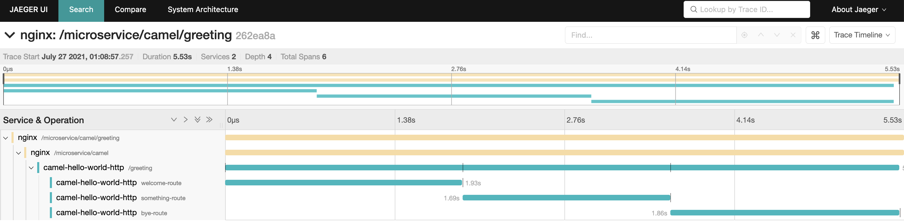
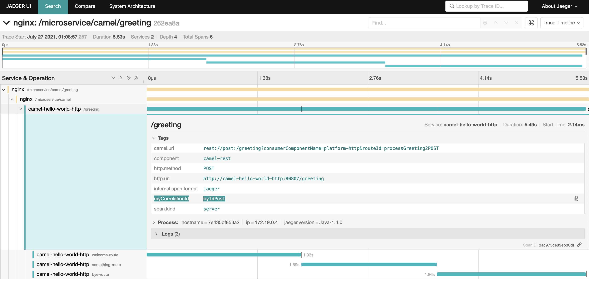

= Observability PoC

This PoC shows how Observability works in a microservices environment. This is a simple PoC where you will see how long is taking each request, detail about internal functionallity and logs across different servers. 

TIP: Generate the image with build.sh in each folder.

== Trafic generation

[source,shell]
----
% curl -H "x-correlation-id: myIdGet" http://localhost/microservice/camel/greeting
% curl -X POST -H "x-correlation-id: myIdPost" http://localhost/microservice/camel/greeting
% curl -H "x-correlation-id: myIdGetGoogle" http://localhost/microservice/camel/getgoogle
----

== Trace visualization

[source,shell]
----
Open in your browser http://localhost:16686/search
----

After generate the traffic you will the services in jaeger.
 

After choose the request you can see the trace.
 

Selecting an span you can see custom tags.
 

== Docker compose output console

[source,shell]
----
% docker-compose up                               
Starting opentracing_upstream_1 ... done
Starting opentracing_jaeger_1   ... done
Starting opentracing_camel-hello-world-http_1 ... done
Starting opentracing_nginx_1                  ... done
Attaching to opentracing_upstream_1, opentracing_jaeger_1, opentracing_camel-hello-world-http_1, opentracing_nginx_1
camel-hello-world-http_1  | 2021-07-26 23:56:09,509 INFO  [org.apa.cam.qua.cor.CamelBootstrapRecorder] (main) Bootstrap runtime: org.apache.camel.quarkus.main.CamelMainRuntime
jaeger_1                  | 2021/07/26 23:56:06 maxprocs: Leaving GOMAXPROCS=8: CPU quota undefined
nginx_1                   | /docker-entrypoint.sh: /docker-entrypoint.d/ is not empty, will attempt to perform configuration
nginx_1                   | /docker-entrypoint.sh: Looking for shell scripts in /docker-entrypoint.d/
camel-hello-world-http_1  | 2021-07-26 23:56:09,511 INFO  [org.apa.cam.mai.BaseMainSupport] (main) Auto-configuration summary
camel-hello-world-http_1  | 2021-07-26 23:56:09,511 INFO  [org.apa.cam.mai.BaseMainSupport] (main)     camel.context.name=camel-hello-world-http
upstream_1                | 2021-07-26 23:55:59.645 Verbose logging enabled
jaeger_1                  | {"level":"info","ts":1627343766.4265172,"caller":"flags/service.go:117","msg":"Mounting metrics handler on admin server","route":"/metrics"}
jaeger_1                  | {"level":"info","ts":1627343766.426582,"caller":"flags/service.go:123","msg":"Mounting expvar handler on admin server","route":"/debug/vars"}
nginx_1                   | /docker-entrypoint.sh: Launching /docker-entrypoint.d/10-listen-on-ipv6-by-default.sh
camel-hello-world-http_1  | 2021-07-26 23:56:09,521 INFO  [org.apa.cam.imp.eng.AbstractCamelContext] (main) Routes startup summary (total:6 started:6)
camel-hello-world-http_1  | 2021-07-26 23:56:09,521 INFO  [org.apa.cam.imp.eng.AbstractCamelContext] (main)     Started processDoSomething (direct://something-route)
camel-hello-world-http_1  | 2021-07-26 23:56:09,521 INFO  [org.apa.cam.imp.eng.AbstractCamelContext] (main)     Started processGreeting2GET (rest://get:/greeting)
camel-hello-world-http_1  | 2021-07-26 23:56:09,522 INFO  [org.apa.cam.imp.eng.AbstractCamelContext] (main)     Started processGreeting2POST (rest://post:/greeting)
camel-hello-world-http_1  | 2021-07-26 23:56:09,522 INFO  [org.apa.cam.imp.eng.AbstractCamelContext] (main)     Started getGoogle (rest://get:/getgoogle)
camel-hello-world-http_1  | 2021-07-26 23:56:09,522 INFO  [org.apa.cam.imp.eng.AbstractCamelContext] (main)     Started processGreeting (direct://welcome-route)
camel-hello-world-http_1  | 2021-07-26 23:56:09,522 INFO  [org.apa.cam.imp.eng.AbstractCamelContext] (main)     Started processGoodbye (direct://bye-route)
camel-hello-world-http_1  | 2021-07-26 23:56:09,522 INFO  [org.apa.cam.imp.eng.AbstractCamelContext] (main) Apache Camel 3.11.0 (camel-hello-world-http) started in 11ms (build:0ms init:4ms start:7ms)
upstream_1                | SLF4J: Failed to load class "org.slf4j.impl.StaticLoggerBinder".
upstream_1                | SLF4J: Defaulting to no-operation (NOP) logger implementation
upstream_1                | SLF4J: See http://www.slf4j.org/codes.html#StaticLoggerBinder for further details.
jaeger_1                  | {"level":"info","ts":1627343766.4267485,"caller":"flags/admin.go:105","msg":"Mounting health check on admin server","route":"/"}
jaeger_1                  | {"level":"info","ts":1627343766.426809,"caller":"flags/admin.go:111","msg":"Starting admin HTTP server","http-addr":":14269"}
jaeger_1                  | {"level":"info","ts":1627343766.4268575,"caller":"flags/admin.go:97","msg":"Admin server started","http.host-port":"[::]:14269","health-status":"unavailable"}
nginx_1                   | 10-listen-on-ipv6-by-default.sh: info: IPv6 listen already enabled
upstream_1                | 2021-07-26 23:56:00.667 Verbose logging enabled
upstream_1                |  /$$      /$$ /$$                     /$$      /$$                     /$$      
upstream_1                | | $$  /$ | $$|__/                    | $$$    /$$$                    | $$      
upstream_1                | | $$ /$$$| $$ /$$  /$$$$$$   /$$$$$$ | $$$$  /$$$$  /$$$$$$   /$$$$$$$| $$   /$$
upstream_1                | | $$/$$ $$ $$| $$ /$$__  $$ /$$__  $$| $$ $$/$$ $$ /$$__  $$ /$$_____/| $$  /$$/
upstream_1                | | $$$$_  $$$$| $$| $$  \__/| $$$$$$$$| $$  $$$| $$| $$  \ $$| $$      | $$$$$$/ 
upstream_1                | | $$$/ \  $$$| $$| $$      | $$_____/| $$\  $ | $$| $$  | $$| $$      | $$_  $$ 
upstream_1                | | $$/   \  $$| $$| $$      |  $$$$$$$| $$ \/  | $$|  $$$$$$/|  $$$$$$$| $$ \  $$
upstream_1                | |__/     \__/|__/|__/       \_______/|__/     |__/ \______/  \_______/|__/  \__/
upstream_1                | 
jaeger_1                  | {"level":"info","ts":1627343766.4282284,"caller":"memory/factory.go:61","msg":"Memory storage initialized","configuration":{"MaxTraces":0}}
camel-hello-world-http_1  | 2021-07-26 23:56:09,525 INFO  [io.quarkus] (main) camel-hello-world-http 2.0.0-SNAPSHOT native (powered by Quarkus 2.0.0.Final) started in 0.028s. Listening on: http://0.0.0.0:8080
camel-hello-world-http_1  | 2021-07-26 23:56:09,526 INFO  [io.quarkus] (main) Profile prod activated. 
camel-hello-world-http_1  | 2021-07-26 23:56:09,526 INFO  [io.quarkus] (main) Installed features: [camel-attachments, camel-core, camel-direct, camel-http, camel-jackson, camel-microprofile-health, camel-microprofile-metrics, camel-opentracing, camel-platform-http, camel-rest, camel-support-common, camel-support-commons-logging, camel-support-httpclient, cdi, jaeger, smallrye-context-propagation, smallrye-health, smallrye-metrics, smallrye-opentracing, vertx, vertx-web]
nginx_1                   | /docker-entrypoint.sh: Launching /docker-entrypoint.d/20-envsubst-on-templates.sh
upstream_1                | port:                         10003
upstream_1                | https-port:                   10443
upstream_1                | https-keystore:               jar:file:/usr/src/upstream/wiremock-standalone.jar!/keystore
upstream_1                | enable-browser-proxying:      false
upstream_1                | disable-banner:               false
upstream_1                | no-request-journal:           false
upstream_1                | verbose:                      true
upstream_1                | 
nginx_1                   | /docker-entrypoint.sh: Launching /docker-entrypoint.d/30-tune-worker-processes.sh
jaeger_1                  | {"level":"info","ts":1627343766.4374409,"caller":"server/grpc.go:76","msg":"Starting jaeger-collector gRPC server","grpc.host-port":":14250"}
jaeger_1                  | {"level":"info","ts":1627343766.4376307,"caller":"server/http.go:47","msg":"Starting jaeger-collector HTTP server","http host-port":":14268"}
jaeger_1                  | {"level":"info","ts":1627343766.4384308,"caller":"server/zipkin.go:48","msg":"Not listening for Zipkin HTTP traffic, port not configured"}
jaeger_1                  | {"level":"info","ts":1627343766.4384658,"caller":"grpc/builder.go:70","msg":"Agent requested insecure grpc connection to collector(s)"}
nginx_1                   | /docker-entrypoint.sh: Configuration complete; ready for start up
jaeger_1                  | {"level":"info","ts":1627343766.4386554,"caller":"channelz/logging.go:50","msg":"[core]parsed scheme: \"\"","system":"grpc","grpc_log":true}
jaeger_1                  | {"level":"info","ts":1627343766.4391994,"caller":"channelz/logging.go:50","msg":"[core]scheme \"\" not registered, fallback to default scheme","system":"grpc","grpc_log":true}
jaeger_1                  | {"level":"info","ts":1627343766.4394963,"caller":"channelz/logging.go:50","msg":"[core]ccResolverWrapper: sending update to cc: {[{:14250  <nil> 0 <nil>}] <nil> <nil>}","system":"grpc","grpc_log":true}
jaeger_1                  | {"level":"info","ts":1627343766.439914,"caller":"channelz/logging.go:50","msg":"[core]ClientConn switching balancer to \"round_robin\"","system":"grpc","grpc_log":true}
jaeger_1                  | {"level":"info","ts":1627343766.4399903,"caller":"channelz/logging.go:50","msg":"[core]Channel switches to new LB policy \"round_robin\"","system":"grpc","grpc_log":true}
jaeger_1                  | {"level":"info","ts":1627343766.4405534,"caller":"grpclog/component.go:55","msg":"[balancer]base.baseBalancer: got new ClientConn state: {{[{:14250  <nil> 0 <nil>}] <nil> <nil>} <nil>}","system":"grpc","grpc_log":true}
jaeger_1                  | {"level":"info","ts":1627343766.4407966,"caller":"channelz/logging.go:50","msg":"[core]Subchannel Connectivity change to CONNECTING","system":"grpc","grpc_log":true}
jaeger_1                  | {"level":"info","ts":1627343766.440965,"caller":"grpclog/component.go:71","msg":"[balancer]base.baseBalancer: handle SubConn state change: 0xc000726810, CONNECTING","system":"grpc","grpc_log":true}
jaeger_1                  | {"level":"info","ts":1627343766.441011,"caller":"channelz/logging.go:50","msg":"[core]Subchannel picks a new address \":14250\" to connect","system":"grpc","grpc_log":true}
jaeger_1                  | {"level":"info","ts":1627343766.441045,"caller":"channelz/logging.go:50","msg":"[core]Channel Connectivity change to CONNECTING","system":"grpc","grpc_log":true}
jaeger_1                  | {"level":"info","ts":1627343766.441781,"caller":"grpc/builder.go:109","msg":"Checking connection to collector"}
jaeger_1                  | {"level":"info","ts":1627343766.441862,"caller":"grpc/builder.go:120","msg":"Agent collector connection state change","dialTarget":":14250","status":"CONNECTING"}
jaeger_1                  | {"level":"info","ts":1627343766.4419854,"caller":"channelz/logging.go:50","msg":"[core]Subchannel Connectivity change to READY","system":"grpc","grpc_log":true}
jaeger_1                  | {"level":"info","ts":1627343766.4420383,"caller":"grpclog/component.go:71","msg":"[balancer]base.baseBalancer: handle SubConn state change: 0xc000726810, READY","system":"grpc","grpc_log":true}
jaeger_1                  | {"level":"info","ts":1627343766.442139,"caller":"grpclog/component.go:71","msg":"[roundrobin]roundrobinPicker: newPicker called with info: {map[0xc000726810:{{:14250  <nil> 0 <nil>}}]}","system":"grpc","grpc_log":true}
jaeger_1                  | {"level":"info","ts":1627343766.4422011,"caller":"channelz/logging.go:50","msg":"[core]Channel Connectivity change to READY","system":"grpc","grpc_log":true}
jaeger_1                  | {"level":"info","ts":1627343766.4422185,"caller":"grpc/builder.go:120","msg":"Agent collector connection state change","dialTarget":":14250","status":"READY"}
jaeger_1                  | {"level":"info","ts":1627343766.443424,"caller":"command-line-arguments/main.go:233","msg":"Starting agent"}
jaeger_1                  | {"level":"info","ts":1627343766.443594,"caller":"querysvc/query_service.go:137","msg":"Archive storage not created","reason":"archive storage not supported"}
jaeger_1                  | {"level":"info","ts":1627343766.4436414,"caller":"app/flags.go:124","msg":"Archive storage not initialized"}
jaeger_1                  | {"level":"info","ts":1627343766.4439263,"caller":"app/agent.go:69","msg":"Starting jaeger-agent HTTP server","http-port":5778}
jaeger_1                  | {"level":"info","ts":1627343766.446078,"caller":"app/static_handler.go:181","msg":"UI config path not provided, config file will not be watched"}
jaeger_1                  | {"level":"info","ts":1627343766.4463892,"caller":"app/server.go:181","msg":"Query server started"}
jaeger_1                  | {"level":"info","ts":1627343766.4464338,"caller":"healthcheck/handler.go:129","msg":"Health Check state change","status":"ready"}
jaeger_1                  | {"level":"info","ts":1627343766.4464624,"caller":"app/server.go:260","msg":"Starting GRPC server","port":16685,"addr":":16685"}
jaeger_1                  | {"level":"info","ts":1627343766.4466083,"caller":"app/server.go:241","msg":"Starting HTTP server","port":16686,"addr":":16686"}
nginx_1                   | 2021/07/26 23:56:12 [notice] 1#1: using the "epoll" event method
nginx_1                   | 2021/07/26 23:56:12 [notice] 1#1: nginx/1.21.1
nginx_1                   | 2021/07/26 23:56:12 [notice] 1#1: built by gcc 8.3.0 (Debian 8.3.0-6) 
nginx_1                   | 2021/07/26 23:56:12 [notice] 1#1: OS: Linux 5.10.25-linuxkit
nginx_1                   | 2021/07/26 23:56:12 [notice] 1#1: getrlimit(RLIMIT_NOFILE): 1048576:1048576
nginx_1                   | 2021/07/26 23:56:12 [notice] 1#1: start worker processes
nginx_1                   | 2021/07/26 23:56:12 [notice] 1#1: start worker process 25
nginx_1                   | 2021/07/26 23:56:12 [notice] 1#1: start worker process 31
nginx_1                   | 2021/07/26 23:56:12 [notice] 1#1: start worker process 32
camel-hello-world-http_1  | 2021-07-27 00:05:26,732 INFO  [processGreeting2GET] (executor-thread-0) Calling welcome route 
camel-hello-world-http_1  | 2021-07-27 00:05:28,290 INFO  [processGreeting] (Camel (camel-hello-world-http) thread #0 - Delay) Welcome 
camel-hello-world-http_1  | 2021-07-27 00:05:28,291 INFO  [processGreeting2GET] (Camel (camel-hello-world-http) thread #0 - Delay) Calling bye route 
camel-hello-world-http_1  | 2021-07-27 00:05:29,490 INFO  [processGoodbye] (Camel (camel-hello-world-http) thread #1 - Delay) Bye 
camel-hello-world-http_1  | 2021-07-27 00:05:33,000 INFO  [getGoogle] (executor-thread-0) Getting google home page
nginx_1                   | 172.19.0.1 - - [27/Jul/2021:00:05:34 +0000] "POST /gen_204?ei=zU3_YL3EPMiigQbF6aLIDg&vet=10ahUKEwj93tGH-oHyAhVIUcAKHcW0COkQhJAHCBQ..s&gl=GB&pc=SEARCH_HOMEPAGE&isMobile=false HTTP/1.1" 404 153 "http://localhost/" "Mozilla/5.0 (Macintosh; Intel Mac OS X 10.15; rv:90.0) Gecko/20100101 Firefox/90.0" "-"
nginx_1                   | 2021/07/27 00:05:34 [error] 25#25: *1 open() "/usr/share/nginx/html/gen_204" failed (2: No such file or directory), client: 172.19.0.1, server: localhost, request: "POST /gen_204?ei=zU3_YL3EPMiigQbF6aLIDg&vet=10ahUKEwj93tGH-oHyAhVIUcAKHcW0COkQhJAHCBQ..s&gl=GB&pc=SEARCH_HOMEPAGE&isMobile=false HTTP/1.1", host: "localhost", referrer: "http://localhost/"
nginx_1                   | 172.19.0.1 - - [27/Jul/2021:00:05:34 +0000] "GET /logos/2020/kitsune/rc6/CTA-Rugby-174787947-174787773.png HTTP/1.1" 404 153 "http://localhost/" "Mozilla/5.0 (Macintosh; Intel Mac OS X 10.15; rv:90.0) Gecko/20100101 Firefox/90.0" "-"
nginx_1                   | 2021/07/27 00:05:34 [error] 25#25: *4 open() "/usr/share/nginx/html/logos/2020/kitsune/rc6/CTA-Rugby-174787947-174787773.png" failed (2: No such file or directory), client: 172.19.0.1, server: localhost, request: "GET /logos/2020/kitsune/rc6/CTA-Rugby-174787947-174787773.png HTTP/1.1", host: "localhost", referrer: "http://localhost/"
nginx_1                   | 2021/07/27 00:05:34 [error] 26#26: *6 open() "/usr/share/nginx/html/images/searchbox/desktop_searchbox_sprites318_hr.webp" failed (2: No such file or directory), client: 172.19.0.1, server: localhost, request: "GET /images/searchbox/desktop_searchbox_sprites318_hr.webp HTTP/1.1", host: "localhost", referrer: "http://localhost/"
nginx_1                   | 2021/07/27 00:05:34 [error] 25#25: *5 open() "/usr/share/nginx/html/logos/2020/kitsune/rc6/CTA-OffsetPlayButtonFrame1.png" failed (2: No such file or directory), client: 172.19.0.1, server: localhost, request: "GET /logos/2020/kitsune/rc6/CTA-OffsetPlayButtonFrame1.png HTTP/1.1", host: "localhost", referrer: "http://localhost/"
nginx_1                   | 172.19.0.1 - - [27/Jul/2021:00:05:34 +0000] "GET /images/searchbox/desktop_searchbox_sprites318_hr.webp HTTP/1.1" 404 153 "http://localhost/" "Mozilla/5.0 (Macintosh; Intel Mac OS X 10.15; rv:90.0) Gecko/20100101 Firefox/90.0" "-"
nginx_1                   | 172.19.0.1 - - [27/Jul/2021:00:05:34 +0000] "GET /logos/2020/kitsune/rc6/CTA-OffsetPlayButtonFrame1.png HTTP/1.1" 404 153 "http://localhost/" "Mozilla/5.0 (Macintosh; Intel Mac OS X 10.15; rv:90.0) Gecko/20100101 Firefox/90.0" "-"
nginx_1                   | 2021/07/27 00:05:34 [error] 25#25: *4 open() "/usr/share/nginx/html/gen_204" failed (2: No such file or directory), client: 172.19.0.1, server: localhost, request: "POST /gen_204?s=webhp&t=aft&atyp=csi&ei=zU3_YL3EPMiigQbF6aLIDg&rt=wsrt.1148,aft.51,prt.44&imn=5&ima=4&imad=0&aftp=953&bl=XSpj HTTP/1.1", host: "localhost", referrer: "http://localhost/"
nginx_1                   | 172.19.0.1 - - [27/Jul/2021:00:05:34 +0000] "POST /gen_204?s=webhp&t=aft&atyp=csi&ei=zU3_YL3EPMiigQbF6aLIDg&rt=wsrt.1148,aft.51,prt.44&imn=5&ima=4&imad=0&aftp=953&bl=XSpj HTTP/1.1" 404 153 "http://localhost/" "Mozilla/5.0 (Macintosh; Intel Mac OS X 10.15; rv:90.0) Gecko/20100101 Firefox/90.0" "-"
nginx_1                   | 2021/07/27 00:05:34 [error] 25#25: *5 open() "/usr/share/nginx/html/logos/2020/kitsune/rc6/kitsune20.js" failed (2: No such file or directory), client: 172.19.0.1, server: localhost, request: "GET /logos/2020/kitsune/rc6/kitsune20.js HTTP/1.1", host: "localhost", referrer: "http://localhost/"
nginx_1                   | 172.19.0.1 - - [27/Jul/2021:00:05:34 +0000] "GET /logos/2020/kitsune/rc6/kitsune20.js HTTP/1.1" 404 153 "http://localhost/" "Mozilla/5.0 (Macintosh; Intel Mac OS X 10.15; rv:90.0) Gecko/20100101 Firefox/90.0" "-"
nginx_1                   | 2021/07/27 00:05:34 [error] 26#26: *6 open() "/usr/share/nginx/html/logos/2020/kitsune/rc6/CTA-OffsetPlayButtonFrame2.png" failed (2: No such file or directory), client: 172.19.0.1, server: localhost, request: "GET /logos/2020/kitsune/rc6/CTA-OffsetPlayButtonFrame2.png HTTP/1.1", host: "localhost", referrer: "http://localhost/"
nginx_1                   | 172.19.0.1 - - [27/Jul/2021:00:05:34 +0000] "GET /logos/2020/kitsune/rc6/CTA-OffsetPlayButtonFrame2.png HTTP/1.1" 404 153 "http://localhost/" "Mozilla/5.0 (Macintosh; Intel Mac OS X 10.15; rv:90.0) Gecko/20100101 Firefox/90.0" "-"
camel-hello-world-http_1  | 2021-07-27 00:06:40,812 INFO  [processGreeting2GET] (executor-thread-0) Calling welcome route 
camel-hello-world-http_1  | 2021-07-27 00:06:41,925 INFO  [processGreeting] (Camel (camel-hello-world-http) thread #0 - Delay) Welcome 
camel-hello-world-http_1  | 2021-07-27 00:06:41,926 INFO  [processGreeting2GET] (Camel (camel-hello-world-http) thread #0 - Delay) Calling bye route 
camel-hello-world-http_1  | 2021-07-27 00:06:43,043 INFO  [processGoodbye] (Camel (camel-hello-world-http) thread #1 - Delay) Bye 
camel-hello-world-http_1  | 2021-07-27 00:07:09,128 INFO  [processGreeting2GET] (executor-thread-0) Calling welcome route 
camel-hello-world-http_1  | 2021-07-27 00:07:10,498 INFO  [processGreeting] (Camel (camel-hello-world-http) thread #2 - Delay) Welcome myId
camel-hello-world-http_1  | 2021-07-27 00:07:10,498 INFO  [processGreeting2GET] (Camel (camel-hello-world-http) thread #2 - Delay) Calling bye route 
camel-hello-world-http_1  | 2021-07-27 00:07:12,104 INFO  [processGoodbye] (Camel (camel-hello-world-http) thread #3 - Delay) Bye myId
camel-hello-world-http_1  | 2021-07-27 00:08:57,259 INFO  [processGreeting2POST] (executor-thread-0) Calling welcome route 
camel-hello-world-http_1  | 2021-07-27 00:08:59,189 INFO  [processGreeting] (Camel (camel-hello-world-http) thread #0 - Delay) Welcome myIdPost
camel-hello-world-http_1  | 2021-07-27 00:08:59,189 INFO  [processGreeting2POST] (Camel (camel-hello-world-http) thread #0 - Delay) Calling something route 
camel-hello-world-http_1  | 2021-07-27 00:09:00,881 INFO  [processDoSomething] (Camel (camel-hello-world-http) thread #7 - Delay) Doing something with myIdPost
camel-hello-world-http_1  | 2021-07-27 00:09:00,882 INFO  [processGreeting2POST] (Camel (camel-hello-world-http) thread #7 - Delay) Calling bye route 
camel-hello-world-http_1  | 2021-07-27 00:09:02,746 INFO  [processGoodbye] (Camel (camel-hello-world-http) thread #1 - Delay) Bye myIdPost
camel-hello-world-http_1  | 2021-07-27 00:10:32,969 INFO  [getGoogle] (executor-thread-0) Getting google home page
----
